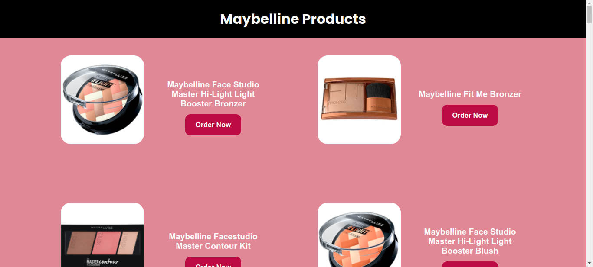
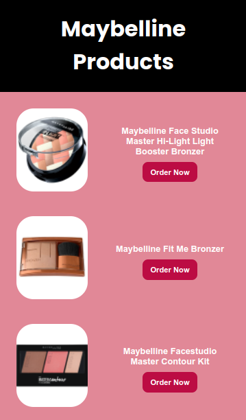

# App Development Exam

## Choose and Fetch the data from the given APIs.

### Requirements 
 - Choose one platform (iOS, Android, Web)
 - App must have a User Interface
 - App must have a dynamic data from the Server via API
 - Code and Task must be in Github.
 - 2 Months deadline

Built using Vanilla HTML CSS and Javascript.

### A sample look in Desktop
;

### UI in Mobile device
